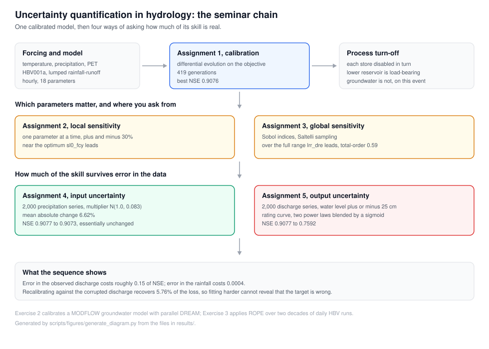

<p align="center">
  
</p>

<h1 align="center">Uncertainty Quantification in Hydrology</h1>

<p align="center">
  <strong>Project Seminar &mdash; Mathematical Methods for Uncertainty Quantification in Hydrology</strong><br/>
  Chair of Hydrology and River Basin Management<br/>
  Technical University of Munich (TUM)
</p>

<p align="center">
  <em>Group B &mdash; Winter Semester 2025/26</em>
</p>

<p align="center">
  <a href="#overview">Overview</a> &bull;
  <a href="#assignments">Assignments</a> &bull;
  <a href="#repository-structure">Structure</a> &bull;
  <a href="#getting-started">Getting Started</a> &bull;
  <a href="#contributors">Contributors</a>
</p>

---

## Overview

This repository contains the complete deliverables for the **Project Seminar on Mathematical Methods for Uncertainty Quantification in Hydrology** at TUM. The seminar follows a progressive workflow &mdash; from model calibration through multiple forms of uncertainty analysis &mdash; applied to the **HBV001a** lumped conceptual rainfall-runoff model.

### Model

| Property | Description |
|:--|:--|
| **Model** | HBV001a (by Faizan Anwar) |
| **Type** | Lumped conceptual rainfall-runoff |
| **Time step** | Hourly |
| **Forcing data** | Temperature, precipitation, potential evapotranspiration |
| **Parameters** | 18 (snow, soil moisture, upper & lower reservoir modules) |
| **Event** | Short, rainfall-dominated high-flow event |

### Key Results at a Glance

| Assignment | Topic | Headline Result |
|:--:|:--|:--|
| 1 | Model Calibration | Best **NSE = 0.908** via Differential Evolution |
| 2 | Local Sensitivity Analysis | `sl0_fcy` (field capacity) dominates near the optimum |
| 3 | Global Sensitivity Analysis | `lrr_dre` (ST = 0.60) dominates globally; strong interactions |
| 4 | Input Uncertainty | 5% precipitation noise degrades NSE by only 0.0004 |
| 5 | Output Uncertainty | Rating-curve errors drop NSE from 0.908 to 0.759 |

---

## Assignments

### Assignment 1 &mdash; Model Parameter Optimization

> **Goal:** Establish a reference calibration using global optimization.

- **Method:** Differential Evolution (`scipy.optimize.differential_evolution`), strategy `best1bin`, population size 10, up to 600 generations
- **Objective function:** Nash-Sutcliffe Efficiency (NSE)
- **Best NSE:** 0.908 (converged at generation 419; practical convergence at ~250)
- **Process turn-off experiments:**
  - Snow module off &rarr; NSE = 0.496 (snow melt is critical)
  - Lower reservoir off &rarr; NSE = -0.754 (model collapse)
  - Groundwater off &rarr; NSE = 0.908 (negligible for short event)

<details>
<summary><strong>Key findings</strong></summary>

- 8 of 18 parameters converge within ~250 generations
- Parameter `urr_ulc` exhibits a sudden shift at ~200 generations, suggesting the optimizer jumped between solution regions
- Insensitive parameters: `sl0_pwp`, `urr_tdh`, `urr_tdr`, `urr_wsr`

</details>

---

### Assignment 2 &mdash; Local Sensitivity Analysis

> **Goal:** Identify which parameters control model performance near the calibrated optimum.

- **Method:** One-at-a-time perturbation, each parameter varied from -30% to +30% in 120 steps
- **Metric:** Maximum absolute relative change in OFV

**Most sensitive parameters (ranked):**

| Rank | Parameter | Description |
|:--:|:--|:--|
| 1 | `sl0_fcy` | Field capacity (dominant control) |
| 2 | `sl0_dth` | Initial soil depth |
| 3 | `lrr_dre` | Lower reservoir drainage ratio |
| 4 | `snw_pmf` / `snw_amf` | Snow melt factors |
| 5 | `urr_ulc` | Percolation rate |

<details>
<summary><strong>Key findings</strong></summary>

- ~10 of 18 parameters are effectively inactive near the optimum
- Four mechanisms for non-sensitivity identified: boundary clamping, inactive processes, flat response surface, small calibrated value
- 3 parameters showed marginal NSE improvement (max 0.015), indicating a locally flat objective surface

</details>

---

### Assignment 3 &mdash; Global Sensitivity Analysis (Sobol Method)

> **Goal:** Quantify parameter importance across the entire parameter space, including interactions.

- **Method:** Sobol variance decomposition with Saltelli quasi-random sampling via `SALib`
- **Configurations tested:** {Full range, Narrow range} x {NSE, logNSE}

| Configuration | V(Y) | Top Parameter (S_T) | Sum S_T | Interactions |
|:--|:--:|:--|:--:|:--|
| Full range + NSE | 0.463 | `lrr_dre` (0.60) | 1.856 | Strong |
| Narrow + NSE | 0.002 | `sl0_fcy` (0.50) | -- | Moderate |
| Narrow + logNSE | 0.109 | `lrr_dre` (0.55) | 1.135 | Low |
| Full + logNSE | 3.2e-5 | Unreliable | -- | -- |

<details>
<summary><strong>Key findings</strong></summary>

- Full-range analysis reveals `lrr_dre` and `lrr_dth` as globally dominant, differing from the local SA ranking
- Sum S_T (1.856) far exceeds 1.0, indicating strong parameter interactions
- logNSE with full-range sampling fails (sum S_1 = 6.28) due to log-divergence at near-zero flows
- Narrow range shrinks V(Y) by a factor of ~440 compared to full range under NSE

</details>

---

### Assignment 4 &mdash; Input (Precipitation) Uncertainty

> **Goal:** Assess how random errors in precipitation propagate through the model.

- **Method:** 2000 perturbed precipitation series via Gaussian multipliers (C ~ N(1.0, 0.083), ~5% noise)
- **Experiments:**
  - (A) Fixed reference parameters &rarr; mean NSE = 0.9073
  - (B) Full recalibration per series &rarr; mean NSE = 0.9075

| Metric | Value |
|:--|:--|
| Mean MARC | 6.62% |
| NSE degradation (fixed params) | -0.0004 |
| Improvement from recalibration | +0.0002 |
| Series improved by recalibration | 95.4% |

<details>
<summary><strong>Key findings</strong></summary>

- Random precipitation noise has minimal impact on model performance
- Recalibration provides marginal improvement but increases parameter uncertainty for slow-response parameters (`urr_tdr`, `urr_tdh`)
- MARC shows negligible correlation with OFV &mdash; performance driven by specific noise realization, not average noise magnitude
- Consistent with Oudin et al. (2006): random errors are benign; systematic bias (not tested) is the greater concern

</details>

---

### Assignment 5 &mdash; Output (Discharge) Uncertainty

> **Goal:** Examine how stage-discharge rating curve uncertainty affects calibration.

- **Method:** Dual-power-law rating curve with sigmoid transition, fitted to QH data (R^2 = 0.9987)
- **Perturbation:** 2000 discharge series generated by perturbing water level by +/-15 cm
- **Impact:** NSE drops from **0.908 to ~0.759** (severe degradation)

| Metric | Value |
|:--|:--|
| Rating curve R^2 | 0.9987 |
| NSE drop | 0.908 &rarr; 0.759 |
| Series degraded | 100% |
| Loss recovered by recalibration | 5.76% |

<details>
<summary><strong>Key findings</strong></summary>

- Output uncertainty has a far more severe impact than input uncertainty
- The model cannot compensate for rating-curve errors through recalibration (only 5.76% recovery)
- Steep QH relationship at high water levels amplifies stage perturbations disproportionately
- Results argue strongly for uncertainty-aware calibration frameworks (e.g., Bayesian approaches as in Westerberg et al., 2020)

</details>

---

## Repository Structure

```
.
|-- code/                               # Python source code
|   |-- Ass_01_Model_Parameter_Optimisation_Group_B.py
|   |-- Ass_01_turnoff_processes_Group_B.py
|   |-- Ass_02_local_SA_Group_B.py
|   |-- Ass_03_Global_SA_Group_B.py
|   |-- Ass_04_Input_Uncertainty_Group_B.py
|   |-- Ass_05_Output_Uncertain_Group_B.py
|   |-- Ass_05_fittingCurve_Group_B.py
|   |-- EX1/                            # Exercise 1 Jupyter notebook
|   |   `-- EX1_MMUQ_Group_B.ipynb
|   `-- EX3/                            # Exercise 3 (ROPE analysis)
|       `-- rope_exercise3_pycodes_Final.zip
|
|-- results/                            # Output data, figures, CSVs
|   |-- assignment1_finial_gen600_atol-3/
|   |-- assignment2/
|   |-- assignment3/
|   |-- assignment4_gen600/
|   |-- assignment5/
|   `-- Ex 2 parallel DREAM-20260111.zip
|
|-- Overleaf_Projects/                  # LaTeX report source
|   |-- Mathematical methods for .../
|   |   |-- main.tex                    # Main document
|   |   |-- acronyms.tex
|   |   |-- literature.bib
|   |   |-- Figures/                    # All assignment figures
|   |   `-- Text/                       # Section text files
|   |-- MOOC_Group_B.zip
|   `-- Mathematical methods ... .zip
|
|-- Exercise3_Latex_Report_HBV.zip      # Exercise 3 report
`-- README.md
```

### Large Files (Git LFS)

The following files are tracked with [Git Large File Storage](https://git-lfs.github.com/):

| File | Size |
|:--|:--:|
| `code/EX3/rope_exercise3_pycodes_Final.zip` | 2.0 GB |
| `results/Ex 2 parallel DREAM-20260111.zip` | 372 MB |

---

## Getting Started

### Prerequisites

- Python 3.10+
- Git LFS (for cloning large files)

### Clone

```bash
# Install Git LFS first (if not already)
git lfs install

# Clone the repository
git clone https://github.com/mzquadri/UQ-Hydrology-Seminar-TUM.git
cd UQ-Hydrology-Seminar-TUM
```

### Dependencies

The project uses the following Python packages:

```
numpy
scipy
matplotlib
pandas
SALib
joblib
```

Install the versioned open-source dependencies with:

```bash
python -m pip install -r requirements.txt
```

### Required course inputs

The forcing, area, and HBV model inputs are course-provided and are not
redistributed here. Assignments 1-4 additionally require the course-provided
`hmg` package containing `HBV001A`. Obtain these materials through the
authorized course channel before executing the scientific workflows.

Set the data directory explicitly rather than editing a source file:

```powershell
$env:HYDROLOGY_DATA_DIR = "C:\path\to\authorized\hmg\data"
```

It must contain `time_series___24163005.csv` and `area___24163005.csv`.
Assignment 5's rating-curve fitting script requires a separately authorized
CSV and accepts its location through:

```powershell
$env:HYDROLOGY_RATING_CURVE_PATH = "C:\path\to\time_series___24163005_without_Outliers.csv"
```

The repository includes result artifacts and report sources, but the full
scientific reruns cannot be reproduced from this repository alone without the
course inputs and `hmg` package. The values above are versioned seminar
results, not independently re-executed claims.

### Integrity check

Run the non-destructive repository check to confirm that the source, key result
artifacts, and LaTeX report entry point are present:

```bash
python scripts/check_repository.py
```

### Windows checkout note

Some report paths are long. On Windows, clone to a short path and enable Git
long paths, for example:

```powershell
git clone --config core.longpaths=true https://github.com/mzquadri/UQ-Hydrology-Seminar-TUM.git C:\g\h
```

---

## Methodology Overview



The seminar builds a progressive chain: a calibrated HBV001a baseline (Assignment 1), local sensitivity around the optimum (Assignment 2), global sensitivity across the full parameter space (Assignment 3), and then two uncertainty propagation studies on the same baseline -- precipitation input noise (Assignment 4) and rating-curve output error (Assignment 5). The key takeaway: output uncertainty dominates, and calibration alone cannot recover it.

---

## References

| Reference | Topic |
|:--|:--|
| Storn & Price (1997) | Differential Evolution algorithm |
| Moriasi et al. (2007) | NSE model evaluation guidelines |
| Saltelli et al. (2002) | Sobol sensitivity indices |
| Oudin et al. (2006) | Impact of biased inputs on watershed models |
| Westerberg et al. (2020) | Calibration with uncertain discharge data |
| Beven (2012) | Rainfall-Runoff Modelling: The Primer |

---

## Contributors

<table>
  <tr>
    <td align="center">
      <a href="https://github.com/mzquadri">
        <br/>
        <sub><b>Mohd Zamin Quadri</b></sub>
      </a>
    </td>
    <td align="center">
      <a href="https://github.com/chrLeers">
        <br/>
        <sub><b>Christine Leers</b></sub>
      </a>
    </td>
    <td align="center">
      <a href="https://github.com/warumso7">
        <br/>
        <sub><b>Yihan Shen</b></sub>
      </a>
    </td>
  </tr>
</table>

---

## License

This project was developed as part of an academic seminar at the Technical University of Munich. All rights reserved by the authors — see [LICENSE](LICENSE), which also records what belongs to the Chair rather than to us, and why no open-source licence is offered for three-author coursework.

---

<p align="center">
  <em>Chair of Hydrology and River Basin Management &mdash; Technical University of Munich</em>
</p>
